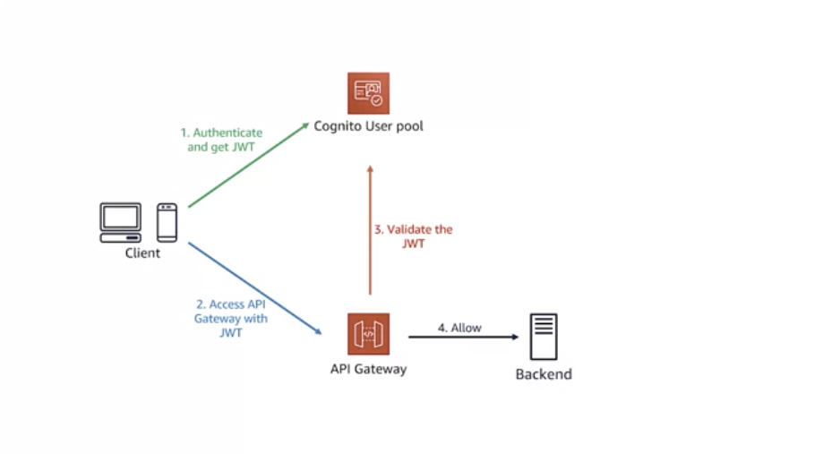
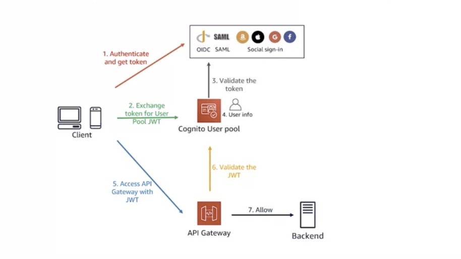
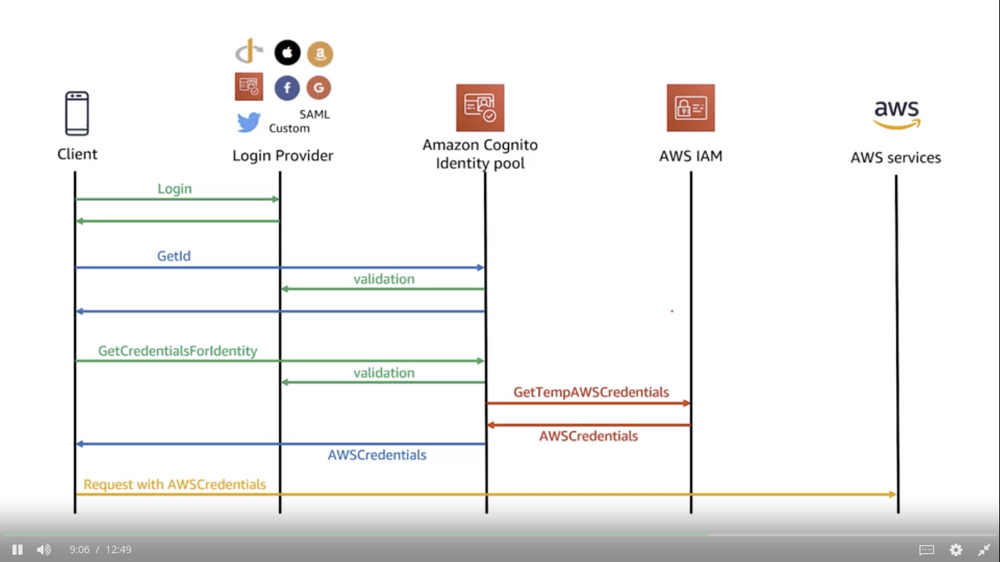
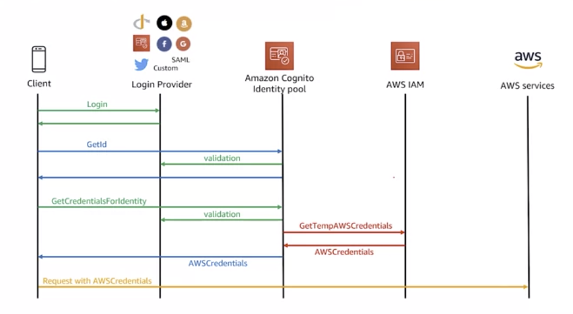
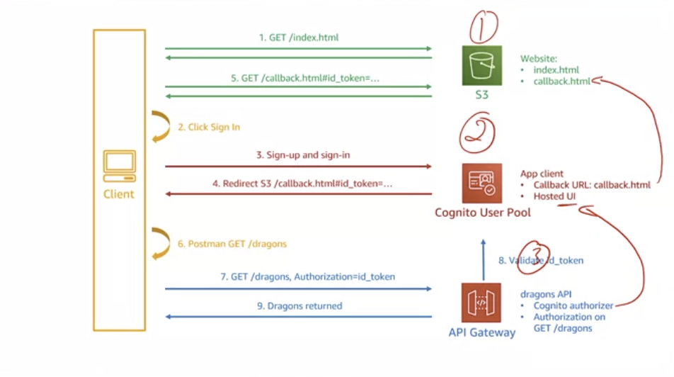

# API Gateway

Service to create, publish, maintain, monitor and secure REST, HTTP and WebSocket APIs.

### Websocket API

Operates using *lower level protocol* based on **sockets** and **ports**. It is
- Vertically scalable
- Bi-directional
- Used for real time scenarios like chatting, video calling etc.

### HTTP APIs

- RESTful APIs with **Lower Latency** + **Lower cost** than REST API

Can use the Gateway to re-direct an incoming request to:
- AWS Lambda Function
- HTTP/HTTPS Endpoint
- Lightweight + Low latency compared to REST API
- Subset of REST API Functionality
- Cheaper compared to REST API
- Supports **Application Load Balancer**
- Can not use API Keys, Caching, Testing, no request validation or transformation

### REST API
- Fast
- Stateless
- Horizontally Scalable
- Standard, Dependable
- Have more latency because of significant overhead
- Does not support **Application Load Balancer**

Further it provides features like:
1. Canary Deployments
2. Cloudtrail Integration
3. Cloudwatch Integration
4. Request throttling
5. Custom domain name
6. Integration with other AWS Services
7. Different Endpoints
   1. **Edge Optimized endpoints**: Best for Geographically distributed endpoints
   2. **Regional Endpoints**: Intended to be used in the same region as the API Gateway
   3. **Private Endpoints**: Exposed through interface VPC endpoints and allows a client to securely access private API Resources inside a **VPC**.


## Concepts

- **Resource**: Abstract concept, a thing for the backend to consume
- **Methods**: Interact with the resource
- **Integration**: Map the incoming request to an AWS Service / another endpoint 

CLIENT --> METHOD REQUEST --> INTEGRATION REQUEST --> API ENDPOINT
CLIENT <-- METHOD RESPONSE <-- INTEGRATION RESPONSE <-- API ENDPOINT

Can apply Data transformations at Request + Response points


## Validate 

Requests/Responses can be validated with **Models**

- Define structure (schema) for the request/response body
- Properties of the payload + Type of each property
- Can be defined at the **Method level**, not the **Resource level**
- Written in JSON

## Trasformation

Requests/Responses can be transformed with **Mappings**

- Applied to integration request/response
- Defined at the **Method Level**, not the **Resource Level**
- Written in **VTL (Velocity Template Language)**
- Supports JSON(default)/XML data as incoming data
- Supports
  - Conditional Statements
  - Injection of new values


## Mock Integration

- For testing purpose
- Return a response from the Gateway, without ever forwarding the request to backend
- Can use **VTL** to return mock data based on the query parameters
- API Gateway provides variables, that start with **$** to extract parameters from the request

```
  #if( $input.params("query_param") == "value" ){}
  #else {}
```
- **Models**: A JSON Schema used to validate incoming requests
  - Set up a model
  - Inside **Method Request**, set up the model in the Request's Body and enable validation for request body


## API Deployment

- **DEPLOYMENT**: Executable/Snapshot of an API

- **STAGE**: It is a named reference to a deployment of an API
  - API Versioning
  - **VARIABLES**: name-value pair associated with a stage. Can be used to interact with different backend endpoints
  - Configure multiple versions of the same API
  - Example: Same lambda function can call different databases based on the stage (Development, Alpha, Beta)
  - Stage creation is necessary to generate client specific SDKs


## Access Control

1. REST API Authentication and Authorization
   1. AWS Identity and Access Management
   2. AWS Lambda
   3. AWS Cognito

2. REST API [Access Control](#access-control-mechanisms)
   1. API Endpoint Resource Policy
   2. VPC Endpoint Policy
   3. AWS WAF (Web Application Firewall)
   4. Usage Plan API Key
   5. Client side SSL Certificate
   6. CORS

3. HTTP API Authentication and Authorization
   1. JWT --> OAuth 2.0
   2. AWS Cognito

**Access Control Mechanisms**
- All methods are server side, except **CORS**
- Client Side SSL Certificate authenticates the API Gateway to our Backend
- Rest of the mechanisms, API Gateway uses to authenticate all the clients


### CORS: Cross Origin Resource Sharing

- It is a browser security feature
- If a browser from http://abc.com makes a request to http://def.com, that is a cross origin request
- To allow for such requests, the browser will look for **RESPONSE HEADERS** by sending an **OPTIONS** Request to the desired endpoint.
```
  AllowOrigin: */"Domain Name"
  AllowMethods: GET,POST
```

### AWS WAF (Web Application Firewall)

- Used to limit access based on
  - IP Addresses
  - HTTP Headers
  - HTTP Method Type

### Usage Plans

1. Create an API Key from AWS API Gateway and share it with the Client
2. With each request the client makes, they will pass this API Key in the header as follows

```
  X-API-KEY: <API-KEY>
```

3. Associate the API Key with a Usage Plan and control
   1. Quota: 100 Requests / Month
   2. Throttling: 10 Requests / Second

4. Not a good authentication mechanism

### Resource Policy

- JSON Schema
- Set granular access to each available request method in the API

```js
{
  "Version": "2012-10-17",
  "Statement":[
    {
      "Effect": "Allow",  // Allow?deny
      "Principal": "*",   // Who can do
      "Action": "execute-api:Invoke", // What to do
      "Resource": "API_ENDPOINT_REQUEST_METHOD_ARN", // On which thing to do
      "Condition": {  // If conditions can be specified here
        "IpAddress":  {
          "aws:SourceIp": "IP Address"  // Implicit Deny
        }
      }  
    }
  ]
}
```

### VPC Policy

- For a private API, which needs to be accessed via an **ec-2 instance** inside a VPC, an **Interface Endpoint** is used.
- Enables us to use privately accessed AWS Services using Private IP Addresses
- Keeps the traffic within AWS
- Can specify a policy for that **interface endpoint** using VPC Policy

## Authentication and Authorization

### AWS IAM

- Use an Access Key and Secret Key to authorize the client
- Typically used for **Server-Server** Communication
- Code running in AWS Instance communicating with AWS Gateway
- Attach an AWS IAM Policy with the Service communicating with the API Gateway

### Cognito User Pool

- User directory
- Can be used to Sign Up/Login the users
- Once signed in, application recieves a **JWT** which is then sent to the API Gateway via Authorization Header
- User for Web/Mobile application to access API Gateway
- User Pool + Identity Pool (Federated Identities)
- **User Pool**
  - User directory a.k.a Identity Provider
  - Enables user to Sign Up, Sign In, Recreate Password and enable MFA
  - Customizable Interface to be displayed to the user
  - Used to authenticate via a third party authenticator (Google, FB etc)
  - Cognito Pool requests the thirdy party authenticator for the info of requesting user, and copies that information locally
  - This copy of the user can be assigned some permission/scope of access
  - Use when need to interact with API Gateway directly and need to store more information about the user
  - Use **Identity Pool** when need to interact with any other AWS Service





- **Identity Pool**
  - Does not store user info like User Pool
  - Can assign certain IAM Role based on the group/user
  - It can also give default ID to unauthorized users 








### Lambda Authorizer

- Piece of code that will execute each time the Gateway recieves a request
- Client sends a request to API Gateway with some parameters
- Those parameters are passed on to the AWS Lambda function
- Lambda function returns a Principal (Defines the User) + Policy (Defines what the user is allowed to do)
- Principal + Policy is **evaluated** and **cached**
- Caching helps to identify the user directly from the **Principal** field without needing to run the lambda function for each request   


## Blogs

- [Microservices](https://docs.aws.amazon.com/whitepapers/latest/microservices-on-aws/api-implementation.html)
- [API Management](https://aws.amazon.com/api-gateway/api-management/)
- [Request Validation](https://docs.aws.amazon.com/apigateway/latest/developerguide/api-gateway-method-request-validation.html)
- [Stage Variables](https://docs.aws.amazon.com/apigateway/latest/developerguide/api-gateway-mapping-template-reference.html)
- [Open ID](https://openid.net/connect/faq/)
- [JWT Authorizer](https://docs.aws.amazon.com/apigateway/latest/developerguide/http-api-jwt-authorizer.html)
